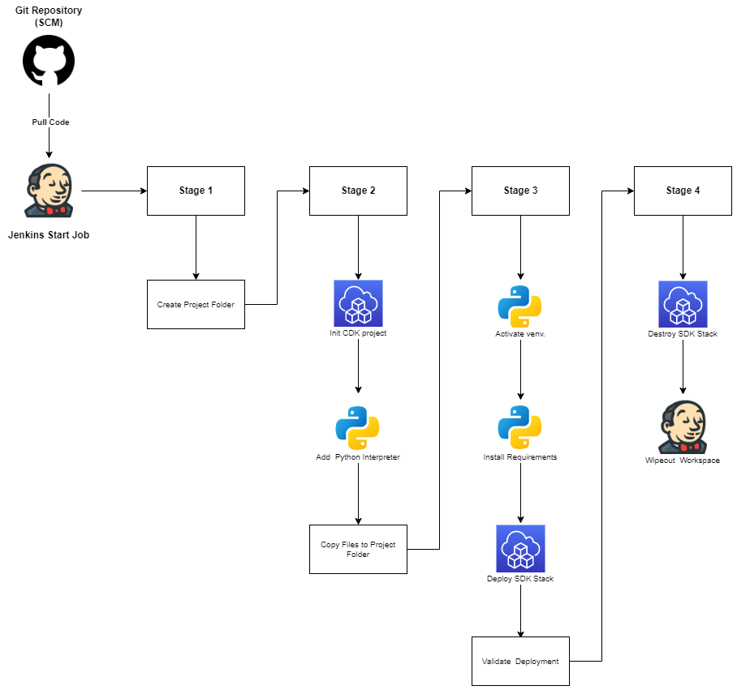

# AWS Hands-On implementar servidor Apache con AWS CDK

## Descripción

Repositorio con el codigo y archivos necesarios para automatizar y orquestar un despliegue de un servidor
Apache utilizando el kit de desarrollo en la nube de AWS (CDK) con Python como lenguaje y Jenkins.

## Diagrama

## Pipeline de despliegue
 

## <b>[Tutorial](https://www.linkedin.com/pulse/servidor-apache-con-aws-cdk-john-ramirez/)</b>
## <b>[< Home](https://github.com/datamadness81)</b>